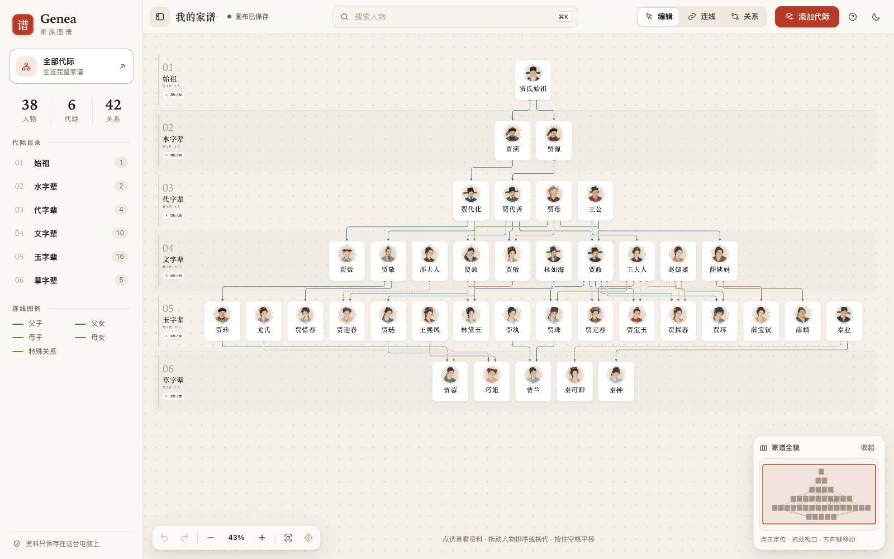

# Genea

一个仍在开发中的本地家谱画布。用人物卡片、代际排布和关系路径，浏览与整理家族结构。

**当前版本：0.1.0-preview.1（预览版）。** 功能与数据模型还会调整。

[在线体验《红楼梦》Demo](https://pifuyuini.github.io/genea/) · [下载源码 ZIP](https://github.com/pifuyuini/genea/releases/download/v0.1.0-preview.1/genea-v0.1.0-preview.1-source.zip) · [版本说明](https://github.com/pifuyuini/genea/releases/tag/v0.1.0-preview.1)



## 两种体验

| | 在线 Demo | 下载后本地运行 |
| --- | --- | --- |
| 数据 | 《红楼梦》38 位人物、6 代、42 条关系 | 可从空白家谱开始，也可运行独立的文学 Demo |
| 浏览 | 缩放、平移、全览、缩略图、搜索、人物详情、A/B 关系路径 | 同样支持 |
| 编辑 | 只读 | 人物与代际编辑、排序、连线、照片、撤销与重做 |
| 运行方式 | GitHub Pages 纯静态，无需安装 | Python 3.12 或更高版本，无第三方依赖 |

在线 Demo 的操作不会写入人物数据。下载完整版后可体验编辑，数据保存在自己的电脑上。

## 下载、安装与启动

1. 下载上方 ZIP，解压后进入包含 `server.py` 的目录。
2. 安装 [Python 3.12 或更高版本](https://www.python.org/downloads/)。无需运行 pip、npm 或安装其他依赖。
3. 在该目录打开终端，选择一种启动方式。

**先体验《红楼梦》Demo**

macOS / Linux：

```sh
python3 demo/run_demo.py
```

Windows：

```powershell
py -3 demo/run_demo.py
```

浏览器打开 <http://127.0.0.1:8766>。Demo 每次启动会从公开样例重置独立的数据目录；加上 `--keep` 可保留上次的演示编辑。按 `Ctrl+C` 停止服务。

**建立自己的家谱**

macOS / Linux：

```sh
python3 server.py --host 127.0.0.1 --port 8765
```

Windows：

```powershell
py -3 server.py --host 127.0.0.1 --port 8765
```

浏览器打开 <http://127.0.0.1:8765>。首次运行自动创建空白工作区，个人数据保存于 `data/`，照片位于 `data/photos/`。停止服务后，复制整个 `data/` 文件夹即可备份；恢复时将其放回应用目录。公开源码包不包含任何个人家谱。

若提示端口被占用，换用例如 `--port 8767`，并访问对应地址。若提示语法或版本错误，先用 `python3 --version`（Windows：`py -3 --version`）确认版本至少为 3.12。

## 常用操作

- 滚轮缩放；按住空格拖动平移；点击「全览」查看完整结构，点击倍率恢复 100%。
- 使用右下角缩略图定位；缩略图获得焦点后可用方向键移动视野。
- 搜索人物并打开详情；选择 A、B 两个人物，查看关系路径；支持浅色与深色主题。
- 本地完整版中可拖动人物排序或跨代移动、维护关系、上传头像、撤销与重做。详细快捷键见应用内帮助。

## 演示内容

公开样例、全部 38 张头像和 6 张截图均位于 `demo/`；介绍与建模限制见 [Demo 说明](demo/README.md)。该样例是文学人物关系的可视化示例，并非《红楼梦》人物考据数据库。

当前关系模型以相邻代际的亲子边为基础，夫妻关系尚未单独建模；称谓与路径结果受录入结构影响。应用尚处于预览阶段，重要数据请另行备份。

## 项目结构与开发

```text
server.py            本地 HTTP 服务与存储
genealogy_core.py    家谱与关系路径计算
static/              共享前端
demo/                公开文学样例、头像、截图和静态适配器
docs/                生成的 GitHub Pages 站点
scripts/             源码打包工具
tests/               Python 与 JavaScriptCore 测试
```

重建静态 Demo：

```sh
python3 demo/build_pages.py
python3 -m http.server 8000 --directory docs
```

打开 <http://127.0.0.1:8000>。不要直接双击 HTML 文件；浏览器需要通过 HTTP 读取静态 JSON。构建时预先计算全部人物对的关系路径；Pages 只读取公开 JSON 和图片，所有编辑入口均禁用。网站资源使用相对路径，支持项目子路径。

公开 Demo 已上线：<https://pifuyuini.github.io/genea/>。无需安装即可体验只读浏览；本地编辑请下载源码包并按上方指引启动。

若在自己的仓库部署，进入 **Settings → Pages → Build and deployment**：Source 选 **Deploy from a branch**，Branch 选 **main**，文件夹选 **/docs**，点击 **Save**。

源码包可用以下命令重建：

```sh
python3 scripts/build_source.py --version v0.1.0-preview.1
```

运行 Python 测试：

```sh
python3 -B -m unittest discover -s tests -p 'test_*.py'
```

macOS 可使用系统 JavaScriptCore 运行每个 `tests/test_*.js`（从仓库根目录执行）：

```sh
for test in tests/test_*.js; do
  /System/Library/Frameworks/JavaScriptCore.framework/Versions/A/Helpers/jsc "$test" || break
done
```

首次公开发布的范围与验证记录见 [发布验收记录](PUBLICATION.md)。本仓库从独立的公开历史开始，发布内容只含应用源码与文学演示素材。
