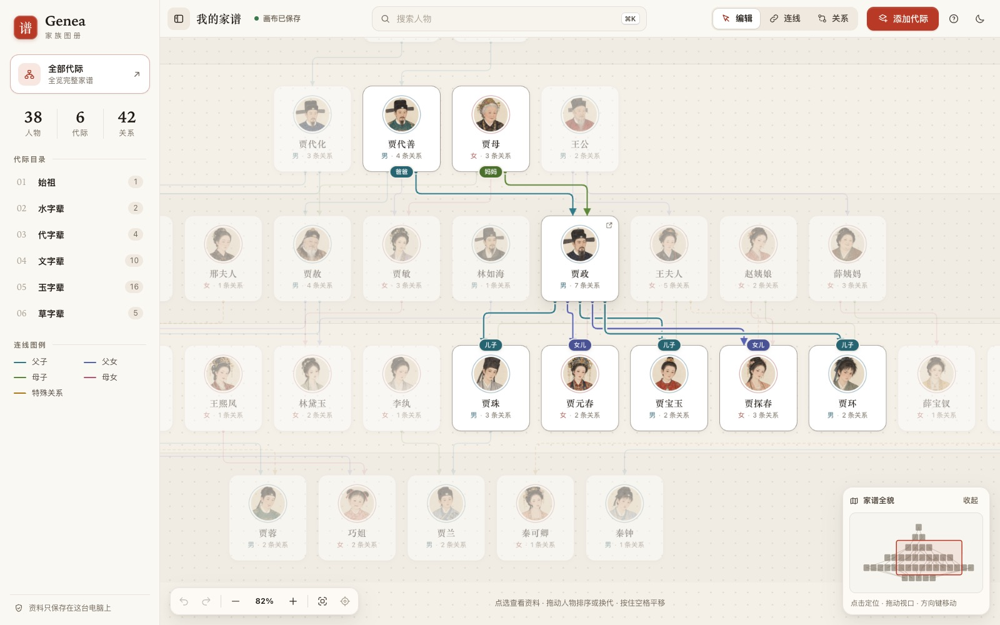
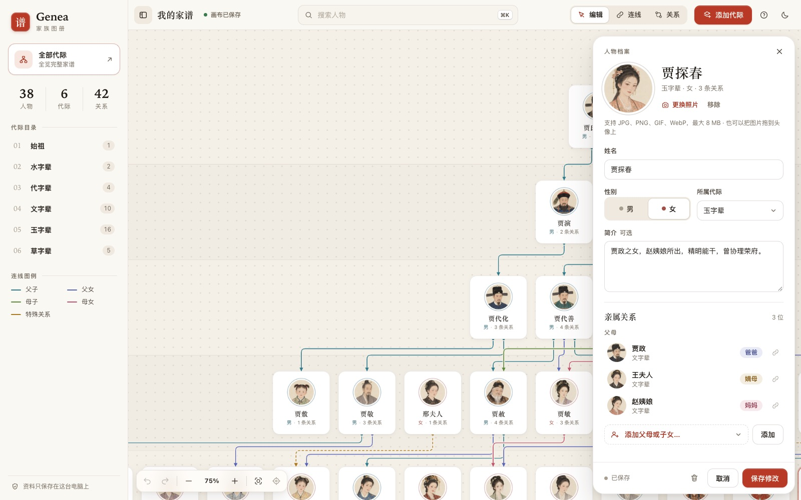
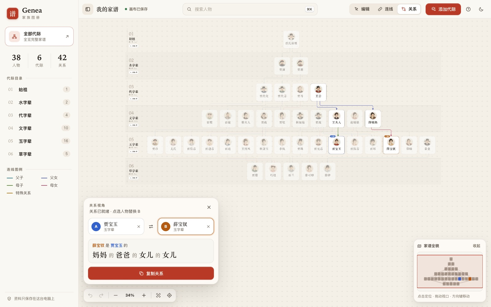
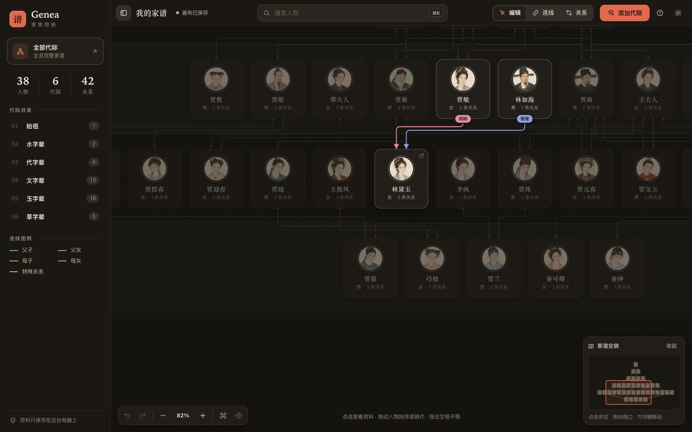
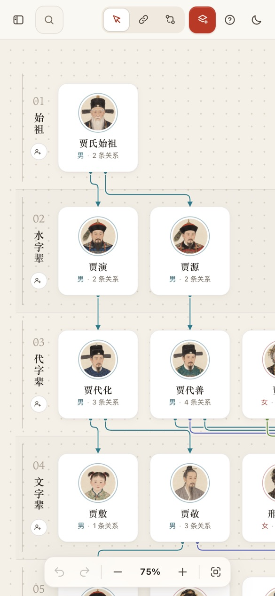

# Genea 演示：《红楼梦》贾府家谱

这是 Genea 家族图册工作台的公开演示。数据取自曹雪芹《红楼梦》中的贾府及其姻亲，全部为虚构的文学人物，可以放心公开展示。


## 快速开始

```bash
python3 demo/run_demo.py            # 打开 http://127.0.0.1:8766
python3 demo/run_demo.py --port 9000
python3 demo/run_demo.py --keep     # 保留上一次演示中的修改
```

只需要 Python 3.12 及以上，不依赖第三方库。每次启动时，脚本会把 `demo/data/` 复制到 `demo/.runtime/`（已被 Git 忽略），再用 `--data-dir` 启动服务。因此演示时随意添加、删除或拖动人物，都不会改动仓库中的演示数据，也不会读写项目根目录的 `data/`。

## 为什么是《红楼梦》

- 贾府按字辈传承，每一辈对应 Genea 的一个代际行：水（演、源）、代、文（敷、敬、赦、政）、玉（珍、琏、珠、玉、环）、草（蓉、兰）。
- 宁、荣两府加上史、王、薛、林、秦诸家，人物多、层级深，能充分展示全览、缩略导航和远景模式。
- 嫡庶与抱养等情节正好对应 Genea 的「特殊关系」。称谓链也天然契合中文亲属称谓，例如「薛宝钗是贾宝玉的妈妈的爸爸的女儿的女儿」，也就是姨表姐。

## 人物关系梳理

共 6 代、38 人、42 条亲子关系，其中 4 条为特殊关系。每代按画面从左到右的顺序排列。

| 代际 | 人物 |
| --- | --- |
| 始祖 | 贾氏始祖\* |
| 水字辈 | 贾演（宁国公）、贾源（荣国公） |
| 代字辈 | 贾代化、贾代善、贾母（史太君）、王公\* |
| 文字辈 | 贾敷、贾敬、邢夫人、贾赦、贾敏、林如海、贾政、王夫人、赵姨娘、薛姨妈 |
| 玉字辈 | 贾珍、尤氏、贾惜春、贾迎春、贾琏、王熙凤、林黛玉、李纨、贾珠、贾元春、贾宝玉、贾探春、贾环、薛宝钗、薛蟠、秦业 |
| 草字辈 | 贾蓉、巧姐、贾兰、秦可卿、秦钟 |

\* 原著未载名讳的连接节点。宁国公与荣国公是“一母同胞弟兄两个”，因此设「贾氏始祖」连通宁、荣两府；设「王公」作为王夫人与薛姨妈之父，连通贾、王、薛三家。

主要支系（父母 → 子女）：

- 宁国府：贾氏始祖 → 贾演 → 贾代化 → 贾敷、贾敬；贾敬 → 贾珍、贾惜春；贾珍 → 贾蓉
- 荣国府：贾氏始祖 → 贾源 → 贾代善；贾代善、贾母 → 贾赦、贾政、贾敏
- 大房：贾赦 → 贾琏、贾迎春；贾琏、王熙凤 → 巧姐
- 二房：贾政、王夫人 → 贾珠、贾元春、贾宝玉；贾政、赵姨娘 → 贾探春、贾环；贾珠、李纨 → 贾兰
- 林家：林如海、贾敏 → 林黛玉
- 王、薛两家：王公 → 王夫人、薛姨妈；薛姨妈 → 薛蟠、薛宝钗
- 秦家：秦业 → 秦钟、秦可卿

特殊关系：

| 上代 | 下代 | 称谓 | 依据 |
| --- | --- | --- | --- |
| 邢夫人 | 贾迎春 | 嫡母 / 庶女 | 迎春为贾赦之妾所出 |
| 王夫人 | 贾探春 | 嫡母 / 庶女 | 探春为赵姨娘所出 |
| 尤氏 | 贾蓉 | 继母 / 继子 | 尤氏为贾珍的继室 |
| 秦业 | 秦可卿 | 养父 / 养女 | 可卿自养生堂抱养 |

建模说明：Genea 只记录相邻两代之间的亲子关系，夫妻关系通过共同子女体现。因此没有子女的婚姻（如宝玉与宝钗、贾蓉与秦可卿）不会显示为连线，秦家也是一个独立的小分支。

## 演示路线

1. **全览**：按 `F` 或点击左下角「全览」，查看六代人物组成的完整树形。缩小到 50% 以下时，卡片会放大姓名。
2. **悬停看称谓**：把鼠标停在「贾政」上，贾代善、贾母的卡片上显示「爸爸 / 妈妈」，五个子女显示「儿子 / 女儿」，其余人物淡出。
3. **人物档案**：点击「贾探春」，亲属关系中同时列出贾政（爸爸）、王夫人（嫡母）和赵姨娘（妈妈），可以直接跳转到任何一位。
4. **关系模式**：按 `R`，依次点选「贾宝玉」和「薛宝钗」，得到「妈妈的爸爸的女儿的女儿」。也可以试试「林黛玉 → 贾宝玉」，或「贾蓉 → 贾宝玉」这样跨越宁、荣两府的长链。
5. **特殊关系**：点击邢夫人与贾迎春之间的虚线，查看「嫡母 / 庶女」的编辑界面。
6. **搜索与深色**：按 `/` 搜索「春」，找到元、迎、探、惜四春；点击右上角的月亮图标切换深色外观。

| 悬停人物时的称谓 | 人物档案与亲属 |
| --- | --- |
|  |  |
| **关系模式称谓链** | **深色外观** |
|  |  |



## 文件说明

| 路径 | 作用 |
| --- | --- |
| `build_demo.py` | 人物与关系的唯一数据源。它通过 `genealogy_core` 生成演示数据，关系会经过与应用相同的校验，ID 和时间戳固定，重复生成的结果完全一致。 |
| `data/workspace.json` | 由 `build_demo.py` 生成的演示数据快照，不含撤销历史。 |
| `data/photos/` | 38 位人物的头像，文件名为 `photo_<人物键>.jpg`。 |
| `run_demo.py` | 把快照复制到 `.runtime/` 后，在独立端口上启动 Genea。 |
| `screenshots/` | 本说明使用的截图。 |

修改人物或关系时，编辑 `build_demo.py` 后运行：

```bash
python3 demo/build_demo.py           # 重新生成 data/workspace.json
python3 demo/build_demo.py --check   # 检查快照是否与脚本一致
```

`tests/test_demo_data.py` 会检查快照与脚本是否一致、每位人物是否都有关系，以及几条典型称谓链。

人物简介依据原著情节概括。书中未写明、需要推断的两位先人已标注为连接节点。

## 人物肖像

38 张肖像由 AI 图像模型按原著的人物描写生成，是原创的工笔风格造型，不取材于任何影视演员。生成时每张图为一个多人肖像网格，再逐格用 macOS Vision 人脸检测定位面部，裁成以面部为中心的 360×360 头像，保存在 `data/photos/`。
